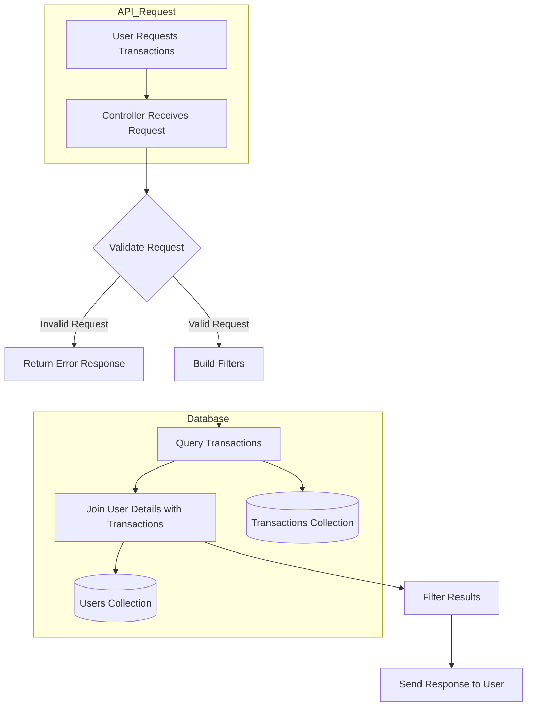

# Transactions API Project

This project provides an API for managing and retrieving user transactions. It allows filtering transactions by various parameters such as status, type, and date range. The backend is built with Node.js, Express, and MongoDB.

---

## Features

1. **User Transactions Management**:
   - Add, retrieve, and filter transactions.
   - Transactions include details like status, type, amount, date, and user information.
2. **User Lookup**:
   - Links transactions to user details via aggregation.
3. **Filters**:
   - Filter transactions by status (`success`, `pending`, `failed`).
   - Filter by type (`credit`, `debit`).
   - Filter by date range (`fromDate` and `toDate`).

---

## How It Works

### System Flow Diagram


---

## API Endpoints

### 1. **Get User Transactions**
#### Endpoint:
```
GET /api/transactions/:userId
```
#### Query Parameters:
| Parameter   | Type   | Description                                        |
|-------------|--------|----------------------------------------------------|
| `status`    | String | Filter by transaction status (`success`, `pending`, `failed`). |
| `type`      | String | Filter by transaction type (`credit`, `debit`).   |
| `fromDate`  | Date   | Start date for filtering transactions.            |
| `toDate`    | Date   | End date for filtering transactions.              |

#### Example Request:
```
GET /api/transactions/64b1a7f5c2a4/userId?status=success&type=credit&fromDate=2023-01-01&toDate=2023-12-31
```

#### Example Response:
```json
{
    "success": true,
    "transactions": [
        {
            "_id": "64b1a7f5c2a4",
            "status": "success",
            "type": "credit",
            "transactionDate": "2023-01-15T12:34:56Z",
            "amount": 1000,
            "userDetails": [
                {
                    "name": "John Doe",
                    "phoneNumber": "1234567890"
                }
            ]
        }
    ]
}
```

---

## Database Schema

### Transactions Collection
| Field            | Type      | Description                          |
|------------------|-----------|--------------------------------------|
| `_id`            | ObjectId  | Unique identifier.                  |
| `status`         | String    | Transaction status (`success`, `pending`, `failed`). |
| `type`           | String    | Transaction type (`credit`, `debit`). |
| `transactionDate`| Date      | Date of the transaction.             |
| `amount`         | Number    | Transaction amount.                  |
| `userId`         | ObjectId  | Reference to the user's ID.          |

### Users Collection
| Field       | Type   | Description          |
|-------------|--------|----------------------|
| `_id`       | ObjectId | Unique identifier.   |
| `name`      | String  | Name of the user.    |
| `phoneNumber`| String | User's phone number. |

---

## How to Run

1. **Set Up Environment**:
   - Create `.env` file with the following variables:
     ```
     MONGO_URI=mongodb://localhost:27017/yourDatabaseName
     PORT=8000
     ```
2. **Install Dependencies**:
   ```bash
   npm install
   ```
3. **Run Application**:
   ```bash
   npm run dev
   ```

---
